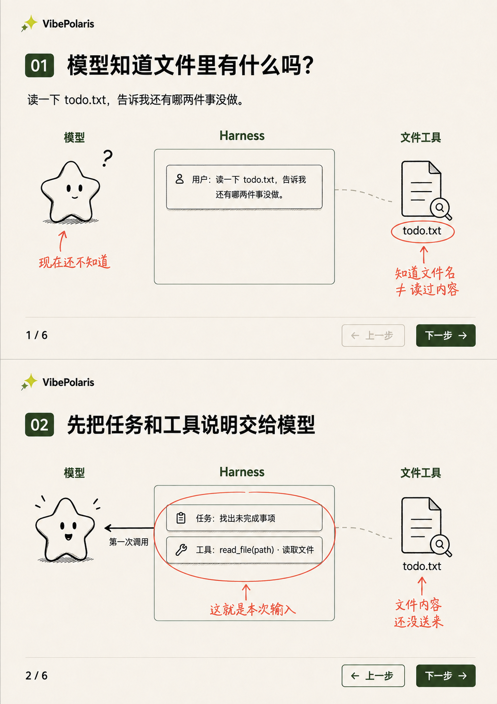
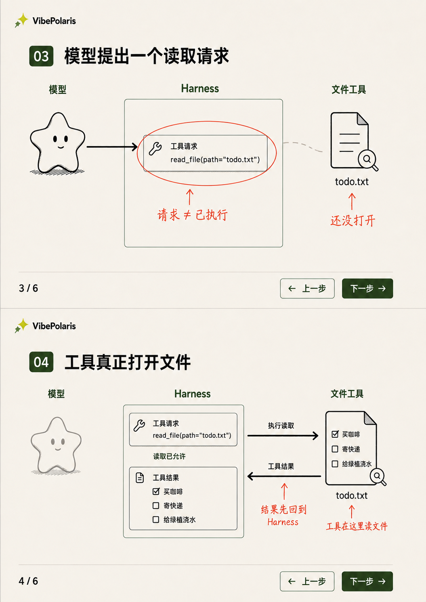
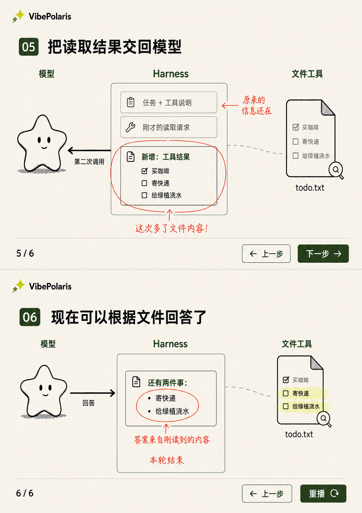

# VBP-004 · 涂鸦连续分镜 R5

2026-09-06。用户要求先设计和画连续分镜，并用涂鸦帮助理解。交付同一方案的六个连续状态，分三张画板；不是三套待选风格。

正式文档：[现有设计文档的 R5 章节](https://ycn7t34xe864.feishu.cn/docx/VWilddQlHoNCEqxlGNjcEwMnn5f)。概念依据与扩展情境继续参照 [R4](../VBP-004-harness-learning-r4/README.md)。

## 最终画板

| 文件 | 连续步骤 | 实际尺寸 |
| --- | --- | --- |
| [01-input.png](01-input.png) | 01 收到任务；02 组织第一次调用的输入 | 1054 × 1492 |
| [02-tool.png](02-tool.png) | 03 模型请求读取；04 工具执行并回传 | 1055 × 1491 |
| [03-result.png](03-result.png) | 05 结果加入上下文；06 再次调用后回答 | 1054 × 1492 |

每张是两幅桌面横向画面上下排列，画板本身为竖向。提示词请求 1536 × 2048，工具返回上表尺寸；原图未裁剪或拉伸。实际网站应按桌面视口重排，不能把画板整体缩小塞入页面。

## 涂鸦与动作设计

黑色实线箭头表示当前步骤的信息方向；灰色虚线是未激活的连接，不表示已经调用。珊瑚红圈注和手写箭头说明概念，不作为数据路径。深绿用于当前步骤和操作；浅黄绿色标出答案来源。模型以手绘星星形象表达，保留网站的星星语言；本轮没有修改首页。

| 步骤 | 入场变化 | 涂鸦解释 | 停留与操作 |
| --- | --- | --- | --- |
| 01 | 用户任务进入 Harness，模型等待，文件未读 | 知道文件名不等于读过内容 | 上一步禁用；下一步继续 |
| 02 | 任务与工具说明组成输入，向左交给模型 | 这就是本次输入；内容还没送来 | 第一次调用出现后停住 |
| 03 | 模型向右返回 read_file 请求 | 请求不等于已执行 | 文件仍保持未读取状态 |
| 04 | 向右执行读取，随后向左返回三行结果 | 工具读文件；结果先回 Harness | 执行与结果回传分先后动画，不能同时出场 |
| 05 | 原输入保留，新增结果圈出，再向左调用模型 | 这次多了文件内容 | 本组最重要的一格，应给足阅读时间 |
| 06 | 模型向右返回两项回答，对应文件未完成行 | 答案来自刚读到的内容 | 本轮结束；下一步替换为重播 |

建议每个动作动画约 350–650 ms，动作后停留直到用户继续；圈注在对应对象出现之后绘出。动画时长是待实现建议，不是实测值。上一步恢复上一状态，不能保留未来结果；重播恢复原始文件与输入。教程按钮只控制讲解时间，不代表真实 Harness 每轮需要人工批准。

第 02 格任务卡是完整任务的可读摘要，后续实现的数据必须仍包含 todo.txt 路径和完整用户请求。模型星星只是角色图标，不能解释为正在展示模型内部思维。

## 自检与修订

- 首张初稿的第 01 格多出一条模型发往 Harness 的箭头，已通过 Image Gen 删除；第 02 格上一步误为禁用，已修正。
- 中间画板初稿的第 03 格请求方向反了，已通过 Image Gen 改为模型 → Harness。最终方向与第 02/05 格的 Harness → 模型相反。
- 第 04/05/06 格检查一致：买咖啡已完成，寄快递和给绿植浇水未完成；回答仅包含后两项，没有把读取变成修改。
- 六格角色、字体风格和颜色保持一致；生成式图像仍有轻微位置、字距和卡片尺寸差异，属于分镜级视觉稿，不是逐像素布局标准。
- 第 04 格将执行和返回放在一个关键帧，实施时必须按先后发生；不允许模型在第 05 格之前拿到工具结果。
- 这组只完成最小成功主线。权限拒绝、找不到文件、验收失败与恢复仍按 R4 作为后续教学分支，不混入本组六格。

## 交付记录

使用内置 Image Gen。完整初始提示词、实际引用图片路径、定向修订提示词与最终文件映射保存在 [generation-prompts.json](generation-prompts.json)。临时错误稿保留在工具原始输出目录，仓库只收录三张最终图。

DP：VBP-004 仍为研发中；本轮分镜任务单独记录图像制作完成，视觉认可与教学效果仍待用户评审。已做逐格图像检查、方向和样例数据核对；未修改业务代码，未运行代码测试，未做浏览器实现验收或 dev/生产部署。现有用户未提交文件保持原样。
