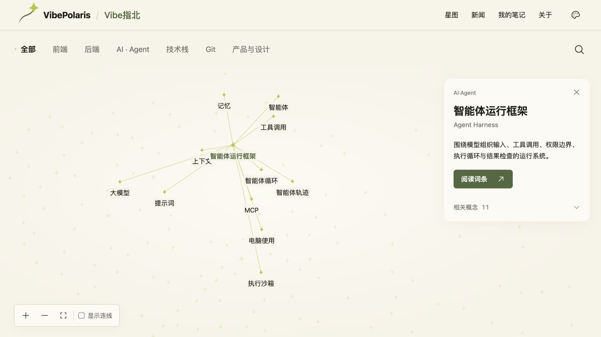
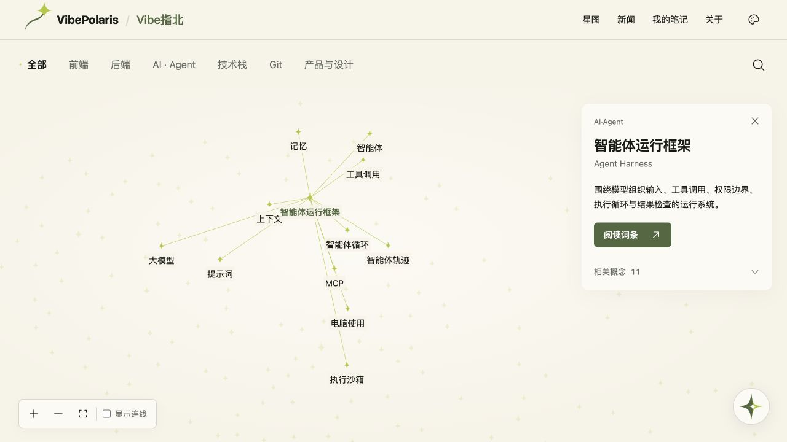

# BUG-E5AFEAE3 · 首页星图性能修复

关联需求：VBP-008；负责人：顾毅盛。基线为 main `dbe42873e59d9447acc205d9e2843cd75a691bda`，373个词条、977条真实关系。远端 dev 缺失，本轮从该 main 提交恢复开发基线，再建立 `fix/BUG-E5AFEAE3-star-map-performance`；原工作区的未跟踪文件保留。

卡顿来源是连续视图操作重新构造全部星点和连线，以及大图远景鼠标扰动反复启动全图模拟。复用新闻星图的大图入场策略，在超过180个节点时使用已经稳定的服务端布局；缩放低于0.75时停用鼠标扰动。直接拖动星点仍启动原有D3模拟并带动邻居，正文9节点局部图保留原有物理反馈。

星点和连线子树使用 React useMemo；平移只更新外层 transform，缩放通过继承的CSS变量保留原字号与星点尺寸。悬停只切换前后两个节点的类。模拟坐标保留小数点后两位，并跳过未变化的transform及连线端点；隐藏连线时不分配端点查找表。

`npm run build`通过，包含TypeScript及1111个静态页面生成。首次尝试因复用工作区依赖的外部软链接被Turbopack拒绝；改用当前已有依赖的本地副本后完成构建，未新增依赖。

2026-10-08真实浏览器限定回归通过，生产构建位于 `http://127.0.0.1:3349`：

- 远景平移前后373个节点坐标全部一致，外层视图按拖动距离改变；滚轮与缩放按钮工作正常。
- 远景键盘聚焦显示可读标签；Harness搜索回车定位URL和详情；分类聚焦与回到全图正常。
- Harness选中时11条关系、全图977条连线；拖动节点保留邻居牵引，重新隐藏全图连线后11条端点与实时坐标最大误差为0。
- 390px视口保留373个节点，文档宽度为390px，搜索、缩放和详情无横向溢出。
- 阅读跳转到Harness；局部9节点、16条边，中心拖动后坐标仍为0/0，邻居可拖动，工具调用阅读入口正确且不改正文URL。
- 浏览器捕获的错误日志为空。未进行FPS或用户设备耗时量化，不宣称具体性能倍数；减少动态偏好及后台恢复沿用原逻辑，本轮未切换系统偏好测试。

DP本地测试计划：`2ad2dca5-1c73-415f-9f43-6c8d12a77757`；用例：`566c6edd-58c2-4e52-bdf1-9f4736b4224f`。修复提交 `b294095ec34d5aa74e00889c8a1b808c007e9310` 经 [PR #458](https://github.com/Gyschuaner/VibePolaris/pull/458) 合入dev，集成提交 `a2979dcc0f59ff40bf87a59633287a0fb6041d28`。本地dev部署批次 `deploy-bug-e5afeae3-local-dev-20261008`；项目未配置独立远端dev服务，本轮在本地生产构建上验证dev集成。指定Obsidian路径 `D:/Obsidian/gysnote`在当前Mac不存在，跳过同步。

## 生产发布

用户明确授权“合并上线”后，[PR #459](https://github.com/Gyschuaner/VibePolaris/pull/459) 从dev合入main，生产代码提交为 `9ed0140521e99277448059d24308b087a0a4c8f8`。该提交的文件树与已验证的dev构建一致。2026-10-08已部署至 https://vibe.chuansgu.top 。

镜像 `vibepolaris:9ed0140521e99277448059d24308b087a0a4c8f8` 使用原生产Linux amd64镜像的依赖与运行环境，仅替换已验证的`.next`构建产物；两次版本之间package、public、Dockerfile及小北服务文件没有变动。服务器校验构建上下文SHA256 `d753a394544cc6b71e1507b4448ff00314c5b2987f528a83b6c2f4c05413427d` 后构建镜像，并验证revision标签与amd64架构。镜像配置摘要为 `sha256:68c75bbc78fc9b8a8749da96b3980aaeb2479429ecfad9aaa72646a65062617b`。

- 发布目录：`/opt/vibepolaris/releases/20261008T020455Z-9ed01405`；容器 `vibepolaris-web-1` 健康状态为healthy。
- HTTPS首页及 `/terms/agent-harness` 均返回200；原数据卷 `vibepolaris_xiaobei_data` 继续挂载至 `/app/.xiaobei`。
- 公网浏览器验证373节点，平移坐标0变化，滚轮缩放、Harness搜索、11条关联及977条全图连线正常。节点拖拽保留物理反馈，重新隐藏全图连线后端点误差为0。
- 阅读入口最终打开Harness，局部图9节点16条边，正文正常，浏览器错误日志为空。首次阅读导航的10秒等待超时，后续键盘激活后最终完成；直接打开词条正常。保留这一观察，不宣称改善页面请求耗时或具体FPS。
- DP生产计划 `2e1cbea3-7667-4e7e-a2a0-e7ebf1ea14c5`，用例 `bf549216-893f-4933-aa99-7f3ccc2c3791`，实际执行 `9e592c54-be3a-4abf-a9f6-7bf6de7e341a`。生产部署批次 `deploy-bug-e5afeae3-prod-20261008`。

切换前使用SQLite在线备份保存数据库，备份目录 `/opt/vibepolaris/backups/20261008T020455Z-from-cd0be6d59939583f3add2cb54b58765b4b4eb336`，数据库摘要 `f13493a9425009553ae4d579cc9eb87d000bfe5f55d7ecc6256a057cb50d96c5`。该目录还保存原compose、镜像和发布目录，SHA256SUMS校验通过。

回滚脚本 `/opt/vibepolaris/releases/20261008T020455Z-9ed01405/rollback.sh` 恢复旧镜像 `vibepolaris:cd0be6d59939583f3add2cb54b58765b4b4eb336` 和原发布目录 `/opt/vibepolaris/releases/20261007T224335Z-cd0be6d5`，保留线上数据卷，不覆盖发布后新增的数据。切换脚本在健康失败时自动回滚，本次容器通过健康检查，未执行回滚。

