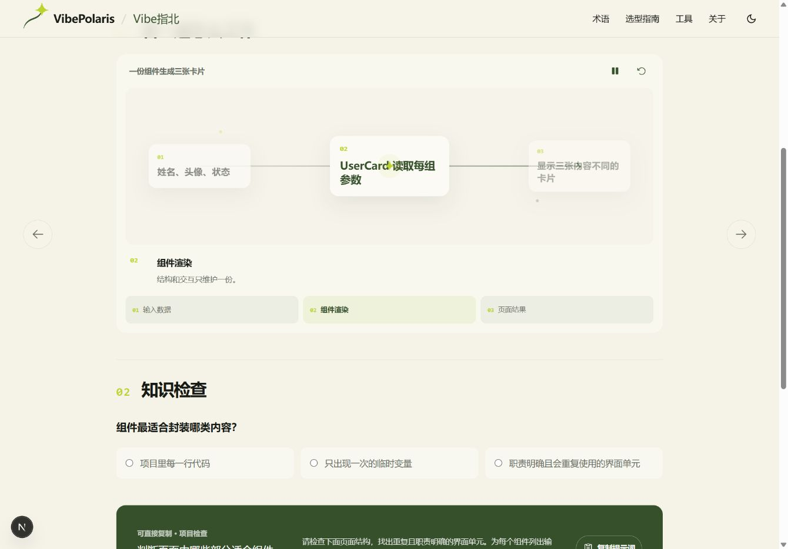
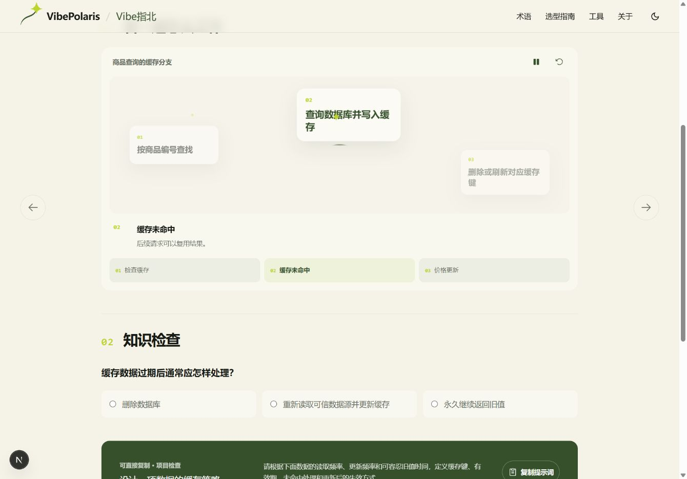
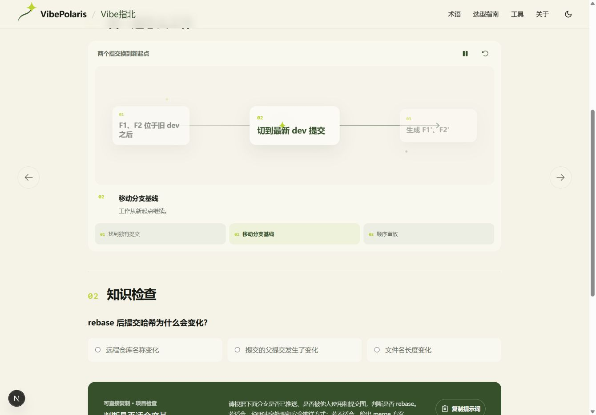
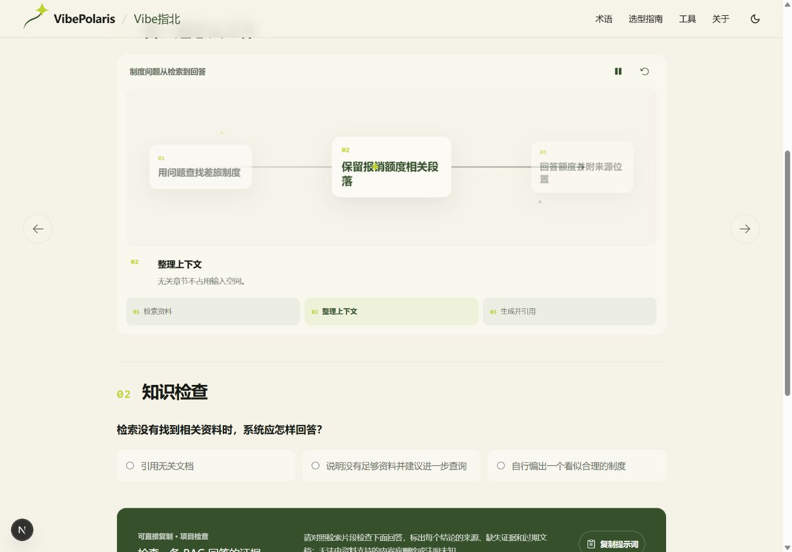
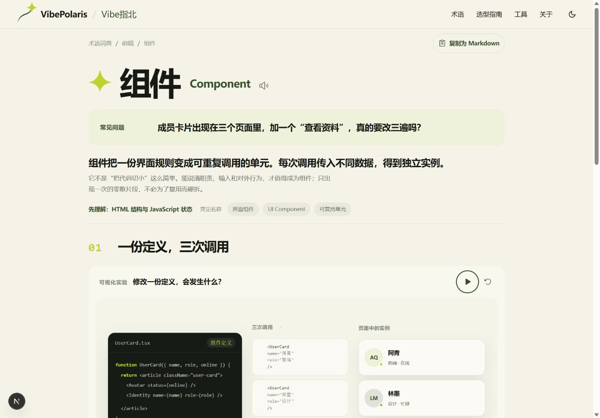
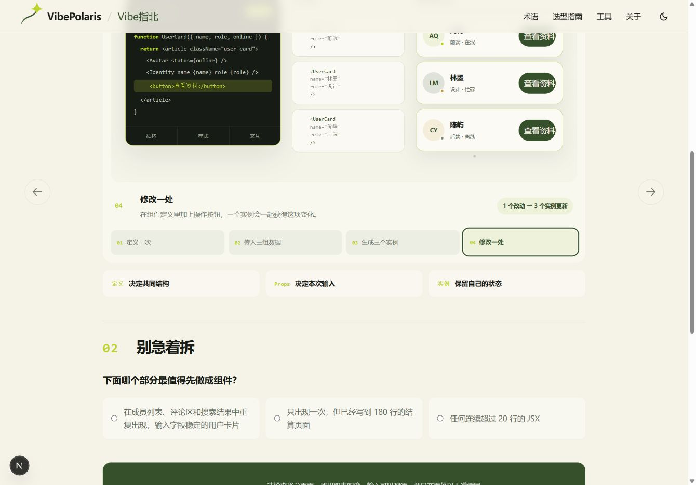

# VBP-001 词条动画同质化审计

## 审计范围

- 产品：VibePolaris 词条详情页。
- 用户目标：不依赖长篇说明，通过动画看懂一个技术概念如何工作。
- 样本：组件、缓存、变基、RAG，覆盖前端、后端、Git、AI·Agent。
- 方式：在桌面浏览器中让动画进入第二帧后截图，对比视觉结构、状态变化和概念辨识度。

## 总体结论

当前动画控制本身稳定，但概念表达不合格。300 条内容只落在 8 种画面模板中，并且全部被压成 3 帧；`flow` 一种就覆盖 74 条。不同概念换了卡片文字，画面结构、视线移动和节奏没有跟着机制变化。

## 01 · 组件

- 健康度：不合格。
- 画面能表达输入、处理、输出，但没有表现“同一组件定义被多个实例复用”这一关键特征。
- 更合适的分镜：一份 `UserCard` 定义位于中央，三组 props 从不同方向进入，生成三个保持同构但内容不同的实例；修改一次定义后，三个实例同步变化。

## 02 · 缓存

- 健康度：不合格。
- 缓存命中、缓存未命中、过期失效是不同分支，目前仍以三个静态卡片顺序播放，无法看出请求绕过数据库后的耗时差。
- 更合适的分镜：同一请求分别走命中与未命中路径，同时显示 8ms / 120ms；过期时缓存条目变灰，请求回源后刷新 TTL。

## 03 · 变基

- 健康度：不合格。
- 文字提到“移动分支基线”，但画面没有提交图、父提交变化或新提交哈希，用户无法看出为什么历史被重写。
- 更合适的分镜：直接展示提交 DAG。`F1—F2` 从旧 `dev` 分叉，随后复制到新 `dev` 形成 `F1′—F2′`，旧提交淡出并保留警告标记。

## 04 · RAG

- 健康度：不合格。
- 现有三卡片没有展示查询、候选文档、相关性排序、上下文预算和引用位置，容易把 RAG 误解为普通资料拼接。
- 更合适的分镜：查询进入检索器，五个候选片段按分数重排，只将 top-2 装入上下文；回答中的两条结论分别连回来源片段。

## 已确认的优点

- 暂停、重播和手动切换具备清楚的可访问名称。
- 当前状态使用 `aria-pressed`，状态说明使用 `aria-live`。
- 黄绿色、留白和低对比辅助元素与现有品牌一致，可以保留。

## 主要结构问题

1. 300 条全部固定为三帧，不论概念需要 2、4 还是 6 个关键状态。
2. 只有 8 种布局；最常见的 `flow` 覆盖 74 条，页面之间的视觉记忆点不足。
3. 动画数据只有 `label / value / note`，无法描述位置、连线、数量、时间、数值、分支、合并、重排或回退。
4. 没有逐页 `storyboard` 和 `sources`，因此“研究过”和“设计过”都无法在数据中验证。

## 重构门槛

- 每条先有独立研究卡，再写正文。
- 每条必须有唯一 `storyboard.signature`；不能只替换词语复用同一场景。
- 帧数由机制决定，允许 2–7 帧。
- 动画必须至少呈现一种可观察变化：位置、数量、路径、状态、时间、值、层级或因果关系。
- 每条记录 1–3 个权威来源；来源缺失时页面不进入完成状态。
- 自动化检查跨页动画签名、场景文本和问题相似度；高相似项必须人工复核。

## 证据限制

截图能确认视觉结构同质化和控件命名，不能单独证明键盘顺序、读屏播报质量或移动端重排；这些需要在新分镜实现后单独验证。

## 第一张逐页重构样本 · Component

- 健康度：通过本轮标杆页验收，可继续打磨。
- 原来的“输入—处理—输出”三卡片被替换为四段专属分镜：一份 `UserCard` 定义、三组 props、三个实例、一次定义修改。
- 第四段直接把同一个“查看资料”按钮加入三个实例，并显示“1 个改动 → 3 个实例更新”，动画结果不依赖解释文字也能辨认。
- 页面补上组件的判断边界，避免把“代码很长”或“超过固定行数”误当成组件化依据。
- 桌面、390px 宽度、暂停/重播、手动分镜、知识检查均已实测；390px 下 `scrollWidth === clientWidth`，未出现横向溢出。
- 可访问性：分镜使用 `aria-pressed`，状态说明使用 `aria-live`，控件最小 44px，并为 `prefers-reduced-motion` 停止自动播放。读屏顺序尚未用真实读屏软件验证。
